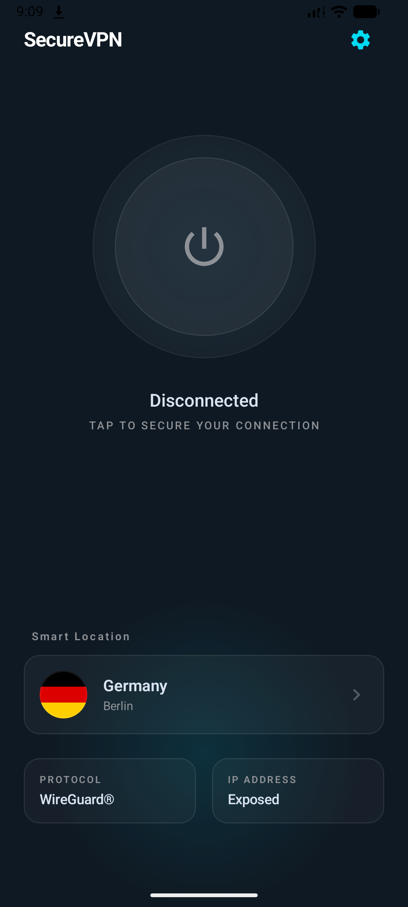
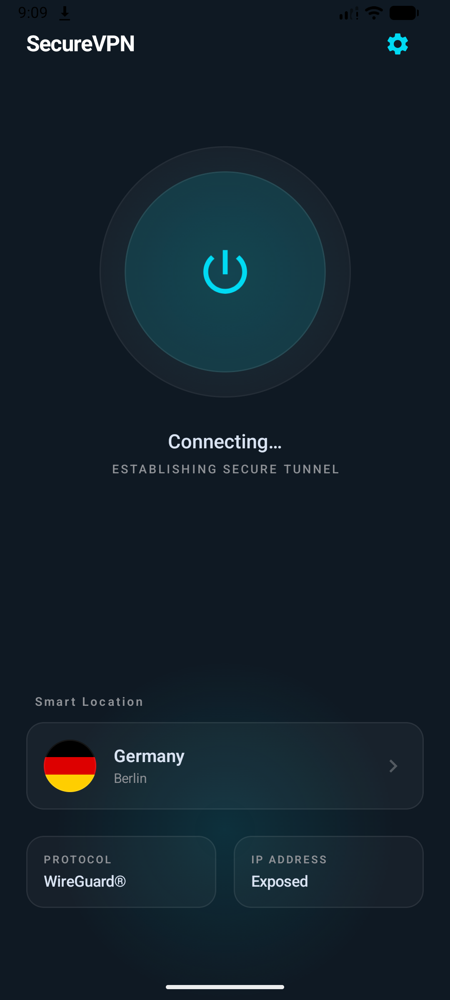
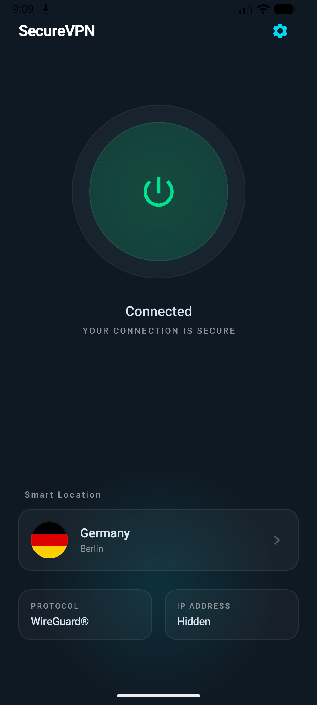
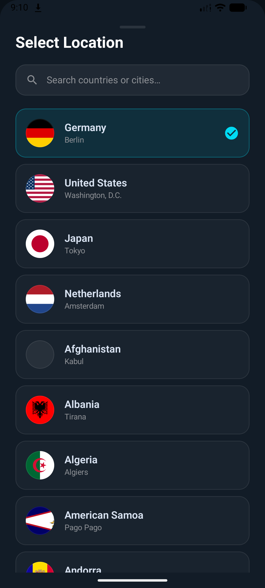

# VPN Demo Android

Demo Android VPN app built for a test assignment with equal focus on UI/UX and architecture.

The app is implemented as a single-screen Compose experience with:
- three VPN states: `Disconnected`, `Connecting`, `Connected`
- country list loading from the REST Countries API
- Room caching for the country list
- retry on connectivity restoration

---

## Screenshots

### Disconnected


### Connecting


### Connected


### Country List



---

## Tech Stack

- Kotlin 
- Jetpack Compose
- Material 3
- Hilt
- Coroutines
- StateFlow
- Retrofit
- OkHttp
- Gson
- Room
- Coil

---

## Architecture

The project follows `MVVM + Clean Architecture` with a strict separation into layers:

```
app/
├── features/
│   └── home          # Home screen (MVVM: State, Event, Effect)
├── domain/
│   └── home          # Use cases & repository interfaces
├── data/
│   └── home          # Repository impl, Service, Mappers
└── core/
    ├── design-system # UI components, theme, colors, typography
    ├── network        # Retrofit setup, API models, VpnWebService
    ├── database       # Room database, CountryEntity, VpnDao
    ├── connectivity   # NetworkMonitor for online/offline detection
    └── vpn            # VPN state model & MockVpnService
```

Flow of dependencies:

```text
View -> ViewModel -> UseCase -> Repository -> DataSource
```

UI flow:

```text
UI action -> HomeEvent -> HomeViewModel -> HomeState / HomeEffect
```

---

## What Was Improved In UI

- Reworked the main screen hierarchy so the connection status, primary action, and server selection are visually separated and easier to scan.
- Replaced the flat prototype feel with a more polished VPN-style presentation: glowing connection orb, stronger contrast, and clearer visual status feedback.
- Made the VPN states visually distinct through color, animation, and text treatment.
- Added a dedicated bottom sheet for server selection instead of overloading the main screen with a long list.

---

## UX Decisions

- The main interaction stays on one screen to keep the connection flow fast and focused.
- The connect action is represented by a large tappable orb to make the primary action obvious and thumb-friendly.
- The server picker is shown as a bottom sheet because it keeps the user in context and works better for a long searchable list.
- The app always surfaces the featured VPN locations first, then appends the remaining API countries in alphabetical order.
- Country loading errors and connection errors are handled as one-shot UI events, so they do not pollute persistent screen state.
- Connectivity restoration triggers a reload when the country list is still empty, which reduces the need to manually restart the app.
- Improved spacing and adaptive layout behavior so the screen scales more cleanly across smaller and larger devices.

---

### Caching Strategy

Country data is cached in a local Room database after the first successful network fetch. Subsequent loads return instantly from the cache, and the network is only called when the cache is empty.

```
getAvailableCountries()
    ├── DB not empty → return from Room
    └── DB empty → fetch from network → sort → save to Room → return
```

---

## Features

- **Country Selection** — bottom sheet with a searchable, scrollable country list loaded from the REST Countries API
- **VPN Connection Simulation** — connect/disconnect flow with `DISCONNECTED → CONNECTING → CONNECTED` states and an animated orb
- **Offline Resilience** — `NetworkMonitor` detects connectivity changes and retriggers country loading when the connection is restored
- **Local Caching** — Room database stores the country list to avoid redundant network calls
- **Loading & Error States** — loading indicator during initial fetch; error dialog on network failure

---

## How To Run

1. Clone the repository
2. Open in Android Studio
3. Sync Gradle
4. Run on a device or emulator with API 26+

Notes:
- The app uses the public [REST Countries API](https://restcountries.com).

---

## Build Convention Plugins

Gradle configuration is managed via `build-logic/` convention plugins to keep module `build.gradle.kts` files minimal and consistent:

| Plugin | Purpose |
|--------|---------|
| `vpn.android.application` | Base Android app config (SDK versions, build types) |
| `vpn.android.library` | Base Android library config |
| `vpn.android.application.compose` / `vpn.android.library.compose` | Adds Compose compiler and dependencies |
| `vpn.hilt` | Adds Hilt + KSP wiring |
| `vpn.android.room` | Adds Room + KSP schema config |
| `vpn.feature.compose` | Shorthand for feature modules (library + compose + hilt) |
